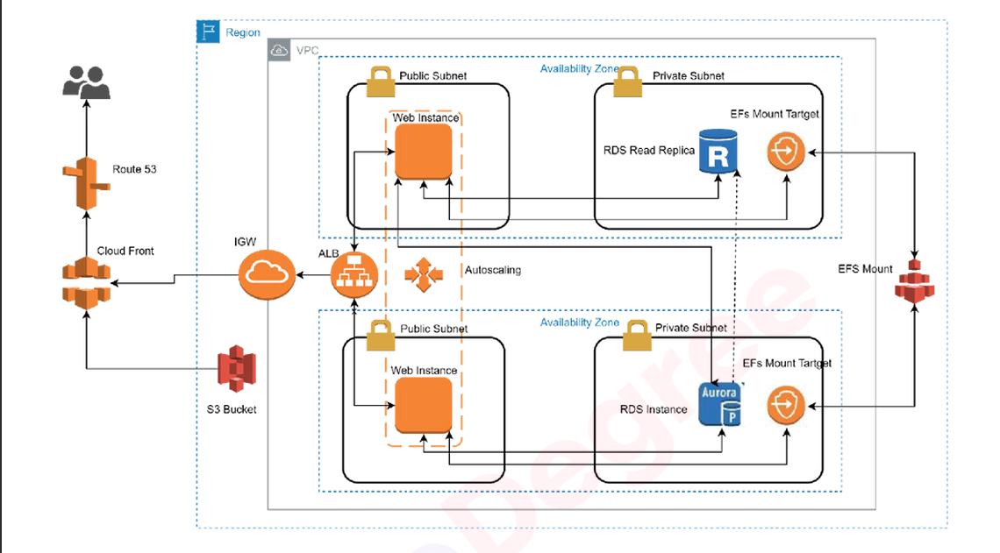

# 🌐 AWS Scalable Web Architecture

## 📌 Project Overview
This project demonstrates a **highly available, fault-tolerant, and scalable web application architecture on AWS**.  
The objective is to ensure **zero downtime** and seamless content delivery for end-users accessing the website.

---

## 🏗️ Architecture Diagram

---

## 🔑 Key Components
- **Amazon Route 53 + CloudFront** → Global DNS & CDN for fast, secure content delivery.
- **Application Load Balancer (ALB)** → Distributes traffic across multiple web instances.
- **Auto Scaling Group** → Automatically scales instances based on traffic demand.
- **Amazon RDS (Aurora with Read Replica)** → Highly available and scalable relational database layer.
- **Amazon EFS (Elastic File System)** → Provides shared and persistent storage for all web instances.
- **Amazon S3 + CloudFront** → Stores and delivers static content (e.g., images, CSS, JS) with low latency.
- **VPC with Public & Private Subnets** → Ensures secure, isolated architecture across multiple Availability Zones.

---

## ⚙️ Features
✅ High Availability – Multi-AZ deployment to prevent downtime  
✅ Scalability – Auto Scaling adapts to traffic spikes  
✅ Security – Private subnets for databases and EFS; controlled access via Security Groups  
✅ Performance – Static content cached via CloudFront; read replicas improve DB performance  
✅ Cost Optimization – Efficient use of managed AWS services and auto scaling  

---

## 🚀 Deployment Steps
1. **Networking** – Set up VPC, subnets (public & private), route tables, and an Internet Gateway.  
2. **Load Balancing & Scaling** – Configure Application Load Balancer with Auto Scaling Group.  
3. **Database Layer** – Deploy Amazon Aurora with a read replica in private subnets.  
4. **Storage Layer** – Mount Amazon EFS across multiple instances for persistent file storage.  
5. **Static Assets** – Upload website assets to S3 bucket and distribute via CloudFront.  
6. **DNS Routing** – Point Route 53 records to CloudFront for global traffic distribution.  

---
